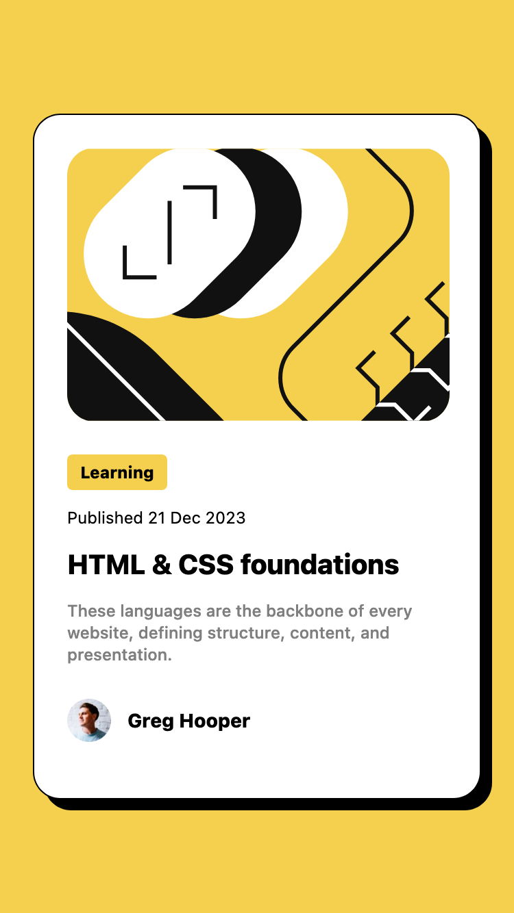
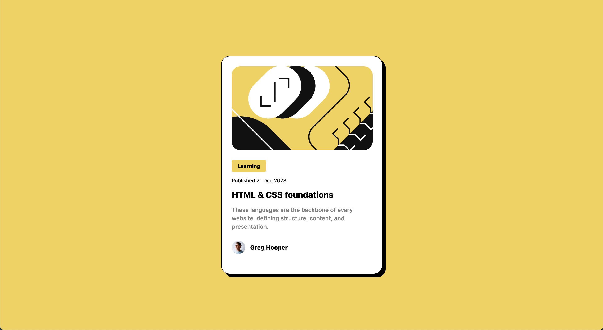

# Frontend Mentor - Blog preview card solution

This is a solution to the [Blog preview card challenge on Frontend Mentor](https://www.frontendmentor.io/challenges/blog-preview-card-ckPaj01IcS). Frontend Mentor challenges help you improve your coding skills by building realistic projects.

## Table of contents

- [Overview](#overview)
  - [The challenge](#the-challenge)
  - [Screenshot](#screenshot)
  - [Links](#links)
- [My process](#my-process)
  - [Built with](#built-with)
  - [What I learned](#what-i-learned)
- [Author](#author)

## Overview

### The challenge

Users should be able to:

- See hover and focus states for all interactive elements on the page

### Screenshot

### Links

- Live Site URL: [Github Pages](https://manishsindur.github.io/Blog-preview-card/)

## My process

### Built with

- Semantic HTML5 markup
- Tailwind Css
- Flexbox
- Mobile-first workflow

### What I learned

I have learned about Utility Classes since I have used [Tailwind CSS](https://tailwindcss.com/docs/installation).

## Author

- Frontend Mentor - [@manishsindur](https://www.frontendmentor.io/profile/manishsindur)
- Twitter - [@manishsindur](https://twitter.com/manishsindur)
